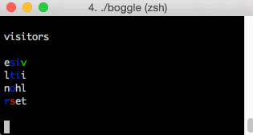

# boggle solver

A simple boggle solver so I can finally beat Katie

# Overview

Given a dictionary file, it builds a trie. 

It then tries to build valid paths. At each path it makes sure that there's children down the path. If not the path is discarded. 

If a path is a valid word over 4 letters, it prints it.

# Contact

c0nrad@c0nrad.io